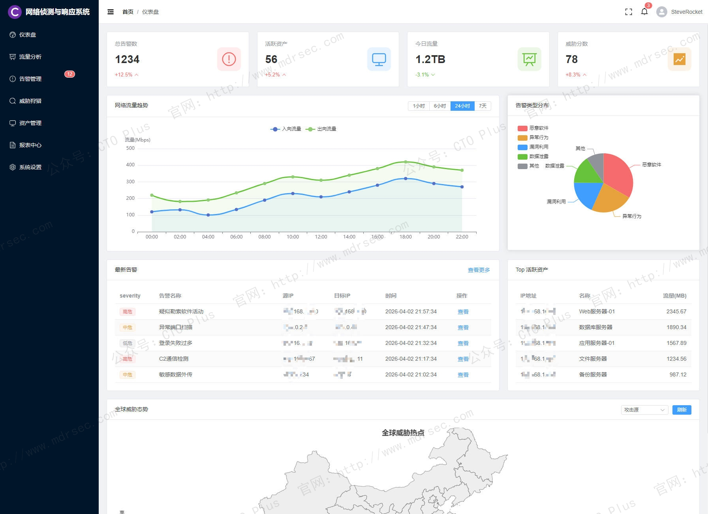
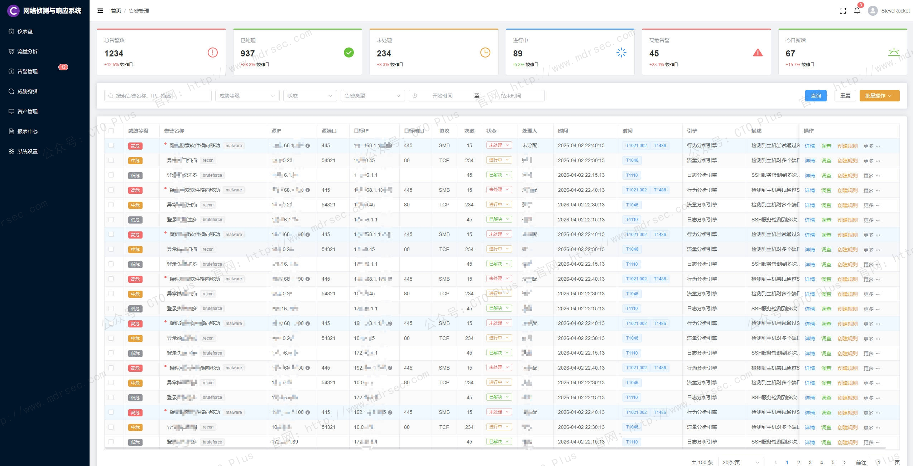
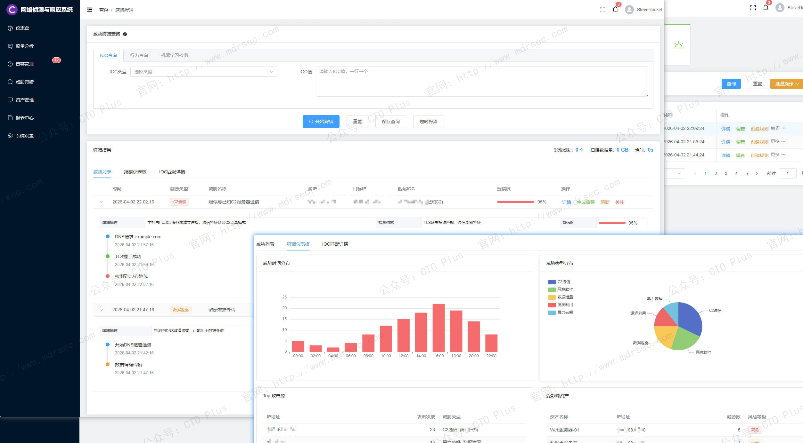
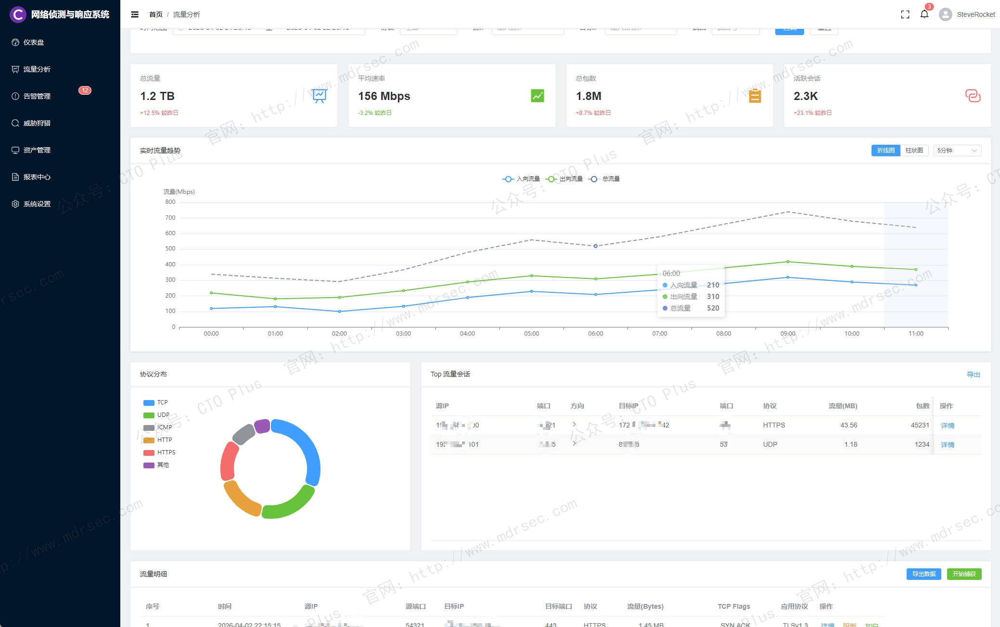
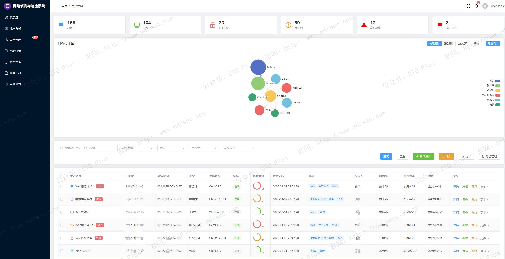

# 网络侦测与响应系统（NDR）

## 关于我们

- 官网： http://www.mdrsec.com

我们的技术文章和产品概述欢迎浏览我们的门户。

- 公众号：CTO Plus

最新的动态欢迎关注我们官方唯一公众号。

- 作者QQ

更详细更具体的需求，或者项目合作，或者问题 欢迎联系我。

- QQ群

我们官方组建的QQ群，如果您有兴趣也可以加入我们。

- 请喝咖啡

如果感兴趣，也可以请我喝杯咖啡

## 产品核心功能模块

企业网络边界日益模糊，攻击者的手法愈发精进。传统基于签名的边界防御设备（如防火墙、IDS/IPS）在面对APT攻击、零日漏洞、加密恶意流量和内部横向移动时，往往力不从心。Gartner于2025年发布的首份《网络检测与响应魔力象限》报告标志着NDR市场已从新兴技术走向成熟，成为现代安全运营中心（SOC）不可或缺的底层设施。

我们的网络侦测与响应系统（Network Detection and Response，简称NDR）的核心价值在于：它不依赖静态规则，而是通过对网络流量的持续监控和行为建模，检测那些绕过边界防御、已在网络内部活动的威胁。正如Gartner所定义，NDR通过行为分析技术监控南北向（内外网边界）和东西向（内网横向）流量，识别异常活动并自动或半自动地触发响应。

这篇文章我将从系统功能模块和特性为大家分享下我们自研了很久的网络侦测与响应系统（Network Detection and Response，简称NDR）

## 多维流量采集能力

NDR的感知层决定了其检测能力的天花板。我们的的NDR系统支持多种流量采集模式以适应复杂的网络架构：

- 物理流量采集：通过物理网络分流器（TAP）或交换机端口镜像（SPAN）获取原始数据包（PCAP），实现线速级的全量数据捕获。TAP方式能保证数据完整性且不丢包，适合核心节点部署；SPAN方式部署灵活但需关注镜像端口的负载能力。
- 虚拟化流量采集：在VMware NSX、OpenStack等虚拟化环境中，通过虚拟交换机镜像或轻量级Agent获取虚拟机之间的东西向流量，实现对虚拟化工作负载的无盲区覆盖。
- 云原生流量采集：支持AWS VPC流量镜像、Azure vTAP、Google Cloud数据包镜像等云原生流量导出能力，以Agent或NFV形态部署，解决多云和混合云环境的流量可见性问题。
- 流量元数据处理：除全量PCAP外，NDR还应支持NetFlow、sFlow、IPFIX等流协议数据采集，以降低全量存储压力并在骨干网实现轻量级监控。

原始流量必须经过深度解码才能转化为可供分析的结构化数据。我们的NDR系统内置强大的协议解析引擎，支持对HTTP/HTTPS、DNS、SMB、LDAP、RDP、SMTP、FTP等3000种以上常见协议的深度识别与字段提取。

元数据提取的维度包括：五元组信息（源/目的IP、端口、协议）、会话时长、字节数/包数统计、应用层字段（如HTTP User-Agent、DNS查询域名、TLS证书指纹JA3/JA3S）、文件传输行为（文件名、MD5）等。这些元数据是后续行为分析和威胁狩猎的数据基础。

加密流量可见性
- TLS指纹识别：通过JA3/JA3S指纹识别TLS握手特征，发现恶意软件家族使用的特定加密库
- 流特征分析：基于包长分布、连接时长、上下行比例等统计特征推断流量行为
- SNI域外泄露检测：监控TLS SNI字段与加密隧道目标的域名一致性
- 高性能解密：在合规前提下，支持通过导入证书私钥或代理方式实现SSL解密，最高性能可达100Gbps线速处理

## 多引擎威胁检测体系：NDR的分析内核

### 特征规则检测引擎

传统入侵检测（IDPS）引擎是NDR的基础防线，负责检测已知威胁。该引擎需内置数万条规则，覆盖漏洞利用（CVE编号映射）、Web攻击（SQL注入、XSS、命令注入）、恶意软件通信（僵尸网络C2特征）、暴力破解、扫描探测等攻击类型。规则库需支持实时更新，并允许安全团队自定义规则以满足特定场景。

### 威胁情报关联引擎

NDR需集成多源威胁情报，包括商业情报源、开源情报、行业情报和自产情报，实时匹配流量中的IP、域名、URL、文件Hash等指标。高级NDR产品应具备情报与流量上下文的关联分析能力——当某个告警命中低可信度情报时，系统会自动叠加行为分析进行二次研判，降低误报率。

### AI驱动的行为分析引擎

这是NDR区别于传统IDS/IPS的核心差异。行为分析引擎通过机器学习算法构建网络行为的动态基线，识别偏离基线的异常活动：
- 无监督学习：对设备间通信模式进行聚类分析，自动发现异常连接关系（如数据库服务器向外网发起HTTP请求、打印机访问域控服务器）。
- 时间序列异常检测：监控流量速率、连接数、数据量的时序变化，发现低速数据窃取、周期性C2心跳等隐蔽行为。
- 横向移动检测：识别内网中的端口扫描、RDP/SMB暴力破解、Pass-the-Hash攻击、远程服务创建等横向扩散行为。
- DNS行为分析：检测DNS隧道、DGA域名生成算法、异常NXDOMAIN响应等DNS层恶意行为。

### 文件沙箱与恶意软件检测

NDR需对流量中传输的文件进行实时还原和动态分析。文件还原引擎从HTTP、SMTP、FTP、SMB等协议中提取文件对象，送入沙箱环境执行。沙箱应支持Windows/Linux/Android等多操作系统环境，监控文件运行时的进程行为、网络连接、注册表修改、API调用等，判定恶意性并输出IOC指标。

### 多引擎关联与攻击链构建

单一检测引擎的告警往往是碎片化的。NDR的核心价值在于将特征规则、情报、行为、沙箱等多维度检测结果进行关联，构建完整的攻击故事：

- 当IDS引擎发现某IP尝试SQL注入时，系统自动关联该IP在同一时间段内的其他行为（如漏洞扫描、文件上传）
- 当沙箱判定某个下载文件为恶意时，系统回溯该文件的传输路径、源IP、关联域名，并检查是否有后续C2通信
- 通过时间线和攻击链模型（如MITRE ATT&CK框架），将离散告警串联为攻击事件，还原攻击者的战术、技术和过程（TTPs）

## 二、流量采集与全网可见性：NDR的感知底座

### 2.2 协议解码与元数据工程化

原始流量必须经过深度解码才能转化为可供分析的结构化数据。NDR系统需内置强大的协议解析引擎，支持对HTTP/HTTPS、DNS、SMB、LDAP、RDP、SMTP、FTP等3000种以上常见协议的深度识别与字段提取。

元数据提取的维度包括：五元组信息（源/目的IP、端口、协议）、会话时长、字节数/包数统计、应用层字段（如HTTP User-Agent、DNS查询域名、TLS证书指纹JA3/JA3S）、文件传输行为（文件名、MD5）等。这些元数据是后续行为分析和威胁狩猎的数据基础。

### 2.3 加密流量可见性

随着TLS 1.3普及，超过90%的企业流量已加密。NDR需具备不依赖解密的加密流量分析能力：

- **TLS指纹识别**：通过JA3/JA3S指纹识别TLS握手特征，发现恶意软件家族使用的特定加密库
- **流特征分析**：基于包长分布、连接时长、上下行比例等统计特征推断流量行为
- **SNI域外泄露检测**：监控TLS SNI字段与加密隧道目标的域名一致性
- **高性能解密**：在合规前提下，支持通过导入证书私钥或代理方式实现SSL解密，最高性能可达100Gbps线速处理

## 三、多引擎威胁检测体系：NDR的分析内核

### 3.1 特征规则检测引擎

传统入侵检测（IDPS）引擎是NDR的基础防线，负责检测已知威胁。该引擎需内置数万条规则，覆盖漏洞利用（CVE编号映射）、Web攻击（SQL注入、XSS、命令注入）、恶意软件通信（僵尸网络C2特征）、暴力破解、扫描探测等攻击类型。规则库需支持实时更新，并允许安全团队自定义规则以满足特定场景。

### 3.2 威胁情报关联引擎

我们的NDR系统集成多源威胁情报，包括商业情报源、开源情报、行业情报和自产情报，实时匹配流量中的IP、域名、URL、文件Hash等指标。我们的NDR系统还具备情报与流量上下文的关联分析能力——当某个告警命中低可信度情报时，系统会自动叠加行为分析进行二次研判，降低误报率。

### 3.3 AI驱动的行为分析引擎

这是我们的NDR系统区别于传统IDS/IPS的核心差异。行为分析引擎通过机器学习算法构建网络行为的动态基线，识别偏离基线的异常活动：

**无监督学习**：对设备间通信模式进行聚类分析，自动发现异常连接关系（如数据库服务器向外网发起HTTP请求、打印机访问域控服务器）。

**时间序列异常检测**：监控流量速率、连接数、数据量的时序变化，发现低速数据窃取、周期性C2心跳等隐蔽行为。

**横向移动检测**：识别内网中的端口扫描、RDP/SMB暴力破解、Pass-the-Hash攻击、远程服务创建等横向扩散行为。

**DNS行为分析**：检测DNS隧道、DGA域名生成算法、异常NXDOMAIN响应等DNS层恶意行为。

### 3.4 文件沙箱与恶意软件检测

我们的NDR系统对流量中传输的文件进行实时还原和动态分析。文件还原引擎从HTTP、SMTP、FTP、SMB等协议中提取文件对象，送入沙箱环境执行。沙箱支持Windows/Linux/Android等多操作系统环境，监控文件运行时的进程行为、网络连接、注册表修改、API调用等，判定恶意性并输出IOC指标。

## 四、自动化响应与编排：从检测到闭环

### 4.1 检测即阻断

我们的NDR系统通常采用旁路部署，对业务零干扰，但这不意味着它只能“旁观”。同时也具备多种主动响应能力：

- **TCP Reset阻断**：检测到恶意会话时，向通信双方发送TCP RST包中断连接
- **防火墙策略联动**：通过API调用防火墙下发黑名单策略，阻断后续攻击流量
- **主机隔离**：与EDR或网络准入控制（NAC）系统联动，将失陷主机从网络中断开
- **DNS sinkhole**：将恶意域名的解析请求重定向到安全地址，阻止C2通信

### 4.2 SOAR集成与自动化剧本

我们的NDR系统支持与主流SOAR（安全编排自动化与响应）平台的预置集成，支持触发自动化响应剧本。典型场景包括：

- 告警富化：自动查询资产信息、地理位置、历史告警，丰富告警上下文
- 工单创建：根据告警等级自动创建Jira/ServiceNow工单并分配责任人
- 邮件通知：向受影响用户或管理员发送预警邮件
- 证据固化：自动导出相关PCAP、日志、沙箱报告作为取证材料

当然，与我们自研的SOAR系统进行联动这是必然的，我们的网络安全产品体系非常的完整。

### 4.3 API优先与生态集成

NDR作为安全数据中枢，具备完善的北向接口，与我们自研的SIEM、EDR/XDR、态势感知平台无缝对接。通过Syslog、Kafka、REST API等方式输出结构化告警和流量元数据，使NDR的检测结果融入企业整体安全运营体系。

## 五、威胁狩猎与溯源取证：安全分析师的工作台

### 5.1 智能威胁狩猎

我们的NDR系统为安全分析师提供主动狩猎工具，支持：

- **自然语言查询**：基于LLM的AI搜索助手，允许分析师以自然语言检索流量数据，如“显示过去24小时内所有访问了以.tk结尾域名的内网主机”
- **可视化狩猎画布**：通过拖拽式界面构建查询逻辑，绘制连接关系拓扑图
- **IOC批量溯源**：输入威胁情报IOC列表，批量检索历史流量中的匹配记录

### 5.2 全包捕获与回溯分析

PCAP是网络取证的“原始录像”。我们的NDR系统支持智能PCAP策略：

- **告警触发式捕获**：仅在检测到威胁时自动留存相关会话的完整数据包，平衡存储成本与取证需求
- **滚动存储窗口**：定义PCAP保留周期（如7-30天），支持分析师在窗口期内对任意历史时段进行回溯检索
- **会话级提取**：支持按五元组、时间范围、应用协议等条件快速提取特定会话的PCAP文件

### 5.3 攻击成功判定与证据链

NDR自动判断攻击是否成功——通过对双向流量的响应报文进行分析，确认攻击载荷是否被目标执行（如Web攻击返回200状态码且包含敏感数据、漏洞利用触发反向连接）。攻击成功的事件应自动聚合证据：攻击报文Payload、响应内容、关联文件、PCAP切片等，形成完整的证据链供安全团队研判。

## 六、资产发现与攻击面管理

被动式资产发现

NDR通过分析流量被动识别网络中的资产，无需主动扫描，避免触发告警或影响业务。可识别的信息包括：

- IP资产清单与MAC地址映射
- 开放端口与服务指纹（Web服务器类型、数据库版本、中间件信息）
- 服务类别识别（HTTP/HTTPS、数据库、邮件、文件共享、远程控制等）
- TLS证书信息与有效期监控

风险暴露面分析

基于资产识别结果，NDR自动评估安全风险：

- 高危端口暴露：识别面向互联网开放RDP、SSH、Redis、MongoDB等高危端口的资产
- 弱口令检测：从流量中提取登录行为，识别明文传输的弱密码或Base64编码的默认口令
- 敏感数据泄露：检测HTTP响应中的身份证号、手机号、银行卡号等敏感信息明文传输
- AK/SK凭证泄露：识别云环境流量中意外传输的AccessKey/SecretKey

## 七、多场景适配与架构弹性

### 7.1 混合网络架构支持

我们的NDR系统适配复杂网络环境：

**物理数据中心**：支持硬件传感器部署，吞吐量从1Gbps到100Gbps弹性扩展，支持DPDK等高性能报文处理技术。

**虚拟化环境**：提供OVA/OVF格式虚拟机镜像，支持VMware、KVM、Hyper-V等主流虚拟化平台。

**公有云环境**：支持AWS、Azure、阿里云、Google Cloud等主流云平台的原生流量镜像，或以Agent模式采集云工作负载流量。

**容器环境**：通过eBPF技术或Sidecar容器获取Kubernetes集群内Pod间流量。

### 7.2 分布式部署与集中管理

对于大型集团或分支机构场景，我们的NDR系统采用“传感器分散部署、管理平台集中统一”的架构。各分支节点的传感器负责本地流量采集和预处理，将元数据和告警上报至总部中心节点；总部平台实现全网告警聚合、策略统一下发和跨节点威胁狩猎。这里我们在大型客户现场对多个地区的厂区进行管理，应用的就是这种架构。

### 7.3 物理隔离与涉密环境

在政府、军工等涉密场景，我们的NDR系统支持完全物理隔离（Air-Gapped）部署，不依赖互联网连接即可完成威胁检测和告警。系统支持离线更新特征库和威胁情报，所有数据在封闭网络内闭环流转。

## 八、可视化与运营仪表板

### 8.1 全景态势感知

NDR控制台提供多维度可视化能力：

- **全局风险地图**：展示攻击源地理分布、受攻击资产TOP N、实时攻击趋势曲线
- **流量仪表盘**：带宽使用Top N应用、协议分布、外连域名排名
- **资产视图**：资产类型统计、新发现资产时间线、高危资产列表
- **告警仪表板**：告警等级分布、告警趋势、处置状态追踪

### 8.2 攻击链可视化

将告警事件按照攻击链阶段（侦察、武器化、投递、利用、安装、C2、目标达成）进行可视化编排，以时间线和拓扑图结合的方式展示攻击路径。安全分析师可点击任一节点下钻查看原始日志和PCAP证据，大幅缩短事件研判时间。

### 8.3 合规报表

我们的NDR系统内置等保2.0、GDPR、PCI-DSS等合规报告模板，支持一键生成满足审计要求的流量审计报表和安全事件统计报表，并提供自定义报表设计器满足企业个性化需求。

## 九、核心性能与扩展性指标

我们自研的NDR系统在以下技术指标上具备竞争力：

| 能力维度 | 关键指标 |
|---------|---------|
| 吞吐处理 | 单传感器支持1Gbps-100Gbps线速处理 |
| 协议识别 | 支持3000+应用协议深度解码 |
| 检测引擎 | 特征规则10万+、行为模型100+、情报源20+ |
| 加密流量 | 解密性能50Gbps+，JA3指纹库覆盖主流恶意软件 |
| PCAP存储 | 智能捕获压缩比10:1，PB级分布式存储 |
| 响应速度 | 威胁告警延迟<1秒，API阻断延迟<3秒 |
| 误报率 | 经调优后<0.1%（结合多引擎关联） |

## 最后

NDR市场正从单纯的“网络IDS替代品”演进为融合NDR、NPM（网络性能监控）、网络取证、攻击面管理的一体化平台。Gartner魔力象限显示，领先厂商如Corelight、Darktrace、ExtraHop等已在AI驱动检测、加密流量分析和云原生适配方面建立差异化优势。

对于企业选型，建议关注以下核心评估维度：

1. **检测能力验证**：通过真实攻击模拟（红蓝对抗）验证NDR对APT、勒索软件、横向移动的检出率和误报率
2. **加密流量覆盖度**：评估不依赖解密的加密威胁检测能力，这在TLS 1.3时代至关重要
3. **生态集成广度**：与现有SIEM、EDR、SOAR的集成是否顺畅，API开放程度如何
4. **架构可扩展性**：能否适应多云、混合云、容器等未来架构演进
5. **运营友好度**：UI/UX设计是否降低分析师使用门槛，AI辅助功能是否切实提效

在攻击者驻留时间平均长达258天的今天，NDR已不仅是“锦上添花”的可选工具，而是企业构建纵深防御体系、实现主动威胁狩猎的关键基础设施。选择一套功能完备、架构先进的NDR系统，意味着企业具备了在网络层与攻击者正面对抗的能力。

## 产品清单

### 企业网络安全运营中心产品

- 资产安全配置管理系统（SCMDB）
- 终端侦测与响应系统（EDR）
- 网络侦测与响应系统（NDR）
- 企业网络资产攻击面管理系统（CAASM）
- 资产暴露面管理系统（AEMS）
- 网络安全蜜罐管理系统（HoneyPot）
- 安全事件收集与告警管理系统（SIEM）
- 扩展侦测与响应系统（XDR）
- 多引擎脆弱性扫描系统（VAS）
- 多源日志审计监测系统（LAS）
- 网络安全威胁情报中心（TIS）
- 网络安全漏洞库管理系统（VDBS）
- 网络安全编排与自动化响应（SOAR）
- 威胁狩猎系统（THS）
- 数据库安全审计系统（DSAS）
- AI智能体安全态势管理系统（AISPM）
- Web防火墙（WAF）
- 网站安全监测平台（WSM）
- 网络安全态势感知平台（SSAP）
- 网络安全自动化应急响应工具系统（NSRT）
- 企业网络安全运维工具系统（SecTools）
- 网络安全自动化等保测评系统（ASES）
- 浏览器安全监测防护系统（BSMPS）
- 网络安全用户实体行为分析系统（UEBA）
- 互联网电信诈骗预警防护系统（TPFWS）
- 云原生安全管理平台（CNAPP）
- 自动化渗透测试系统（PTS）
- 工业企业信息安全监测中心（IoT SOC）
- 企业智能安全运营中心（AISOC）

### 企业自动化运维产品

- 运维智能监控告警管理平台（AIMAMS）
- 企业网络工具系统（NTools）
- 自动化测试系统（AutoTest）
- 自动化运维系统（AutoOps）
- 企业运维工具系统（OpsTools）
- 物联网管理系统（IoTS）
- 软件开发生命周期管理系统（SDLC）
- IT流程管理系统（ITSM）

### 企业数字化运营资源管理系统产品

- 制造执行管理系统（MES）
- 运输管理系统（TMS）
- 跨境电商企业资源管理系统（ERP）
- 企业客户关系管理系统（CRM）
- 跨境电商仓库管理系统（WMS）
- 财务管理系统（FMS）
- 质量管理系统（QMS）
- 精准营销管理系统（PMS）
- 智能生产管理系统（SPMS）
- 电商BI系统（BI）
- 智能互联网分布式爬虫系统（AISpider）

## ABOUT

**【关于我们】**

* [主页：http://116.205.137.183/index_pro.html](http://116.205.137.183/index_pro.html)
* [Articulate v1.0](https://mp.weixin.qq.com/s/0yqGBPbOI6QxHqK17WxU8Q)
* [Articulate v2.0](https://mp.weixin.qq.com/s/V5Axn-ZWi22ubh5Jiocb9g)

 🥰

**【代码工程系列】**

* [Python和Go的设计模式](https://github.com/zrf-rocket/DesignPattern)
    * GitHub：https://github.com/zrf-rocket/DesignPattern
    * Gitee：https://gitee.com/SteveRocket/design_pattern

* [Python、Go的编码技巧cookbook](https://github.com/zrf-rocket/CookBook)
    * GitHub：https://github.com/zrf-rocket/CookBook
    * Gitee：https://gitee.com/SteveRocket/cook-book

* [Go代码示例](https://github.com/zrf-rocket/PracticeGo)
    * GitHub：https://github.com/zrf-rocket/PracticeGo
    * Gitee：https://gitee.com/SteveRocket/practice_go

* [Python代码示例](https://github.com/zrf-rocket/PracticePython)
    * GitHub：https://github.com/zrf-rocket/PracticePython
    * Gitee：https://gitee.com/SteveRocket/practice_python

* [Python Web框架的示例代码](https://github.com/zrf-rocket/PythonFramework)
    * GitHub：https://github.com/zrf-rocket/PythonFramework
    * Gitee：https://gitee.com/SteveRocket/python_framework

* [Rust代码示例](https://github.com/zrf-rocket/PracticeRust)
    * GitHub：https://github.com/zrf-rocket/PracticeRust
    * Gitee：https://gitee.com/SteveRocket/practice_rust

* [Vue代码示例](https://github.com/zrf-rocket/PracticeVue)
    * GitHub：https://github.com/zrf-rocket/PracticeVue
    * Gitee：https://gitee.com/SteveRocket/practice_vue

* [前端代码示例](https://github.com/zrf-rocket/PracticeFronted)
    * GitHub：https://github.com/zrf-rocket/PracticeFronted
    * Gitee：https://gitee.com/SteveRocket/practice_fronted

* [Python自动化测试框架](https://github.com/zrf-rocket/PythonTestAutomationFramework)
    * GitHub：https://github.com/zrf-rocket/PythonTestAutomationFramework
    * Gitee：https://gitee.com/SteveRocket/python_test_automation_framework

* [Python和Go的算法代码示例](https://github.com/zrf-rocket/Algorithms)
    * GitHub：https://github.com/zrf-rocket/Algorithms
    * Gitee：https://gitee.com/SteveRocket/Algorithms

* [Python和Go的数据结构代码示例](https://github.com/zrf-rocket/DataStructure)
    * GitHub：https://github.com/zrf-rocket/DataStructure
    * Gitee：https://gitee.com/SteveRocket/data_structure

* [编码规范](https://github.com/zrf-rocket/DevGuide)
    * GitHub：https://github.com/zrf-rocket/DevGuide
    * Gitee：https://gitee.com/SteveRocket/develop_guide

* [编码安全规范](https://github.com/zrf-rocket/SecGuide)
    * GitHub：https://github.com/zrf-rocket/SecGuide
    * Gitee：https://gitee.com/SteveRocket/security_guide

**【产品系列】**

* [主机监控系统-日志收集与报警管理系统（SIEM）](https://github.com/zrf-rocket/SIEM)
    * GitHub：https://github.com/zrf-rocket/SIEM
    * Gitee：https://gitee.com/SteveRocket/siem

* [安全运营中心（SOC）-终端侦测与响应系统（EDR）](https://github.com/zrf-rocket/EDR_SOC)
    * GitHub：https://github.com/zrf-rocket/EDR_SOC
    * Gitee：https://gitee.com/SteveRocket/edr_soc

* [DevSecOps-SDLC](https://github.com/zrf-rocket/DevSecOps-SDLC)
    * GitHub：https://github.com/zrf-rocket/DevSecOps-SDLC
    * Gitee：https://gitee.com/SteveRocket/dev-sec-ops-sdlc

* [AI图像识别-智能缺陷检测系统]()
    * [基于AI图像识别的工业缺陷检测应用系统（GPU&FPGA）](https://mp.weixin.qq.com/s/04qefQFg-Pg1Gcqq1vBLQQ)
    * [基于AI图像识别的智能缺陷检测系统，在钢铁行业的应用-技术方案](https://mp.weixin.qq.com/s/dSHbnuOwQZzE4CvPr1JYjg)

# 安全运营中心（SOC）-网络侦测与响应系统（NDR） 

